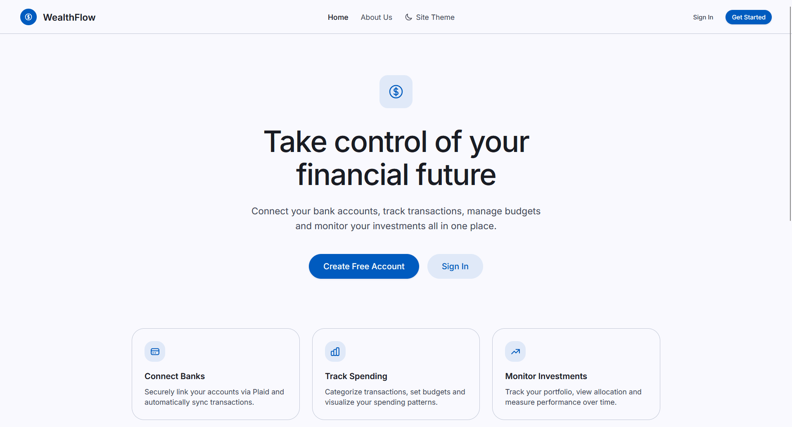
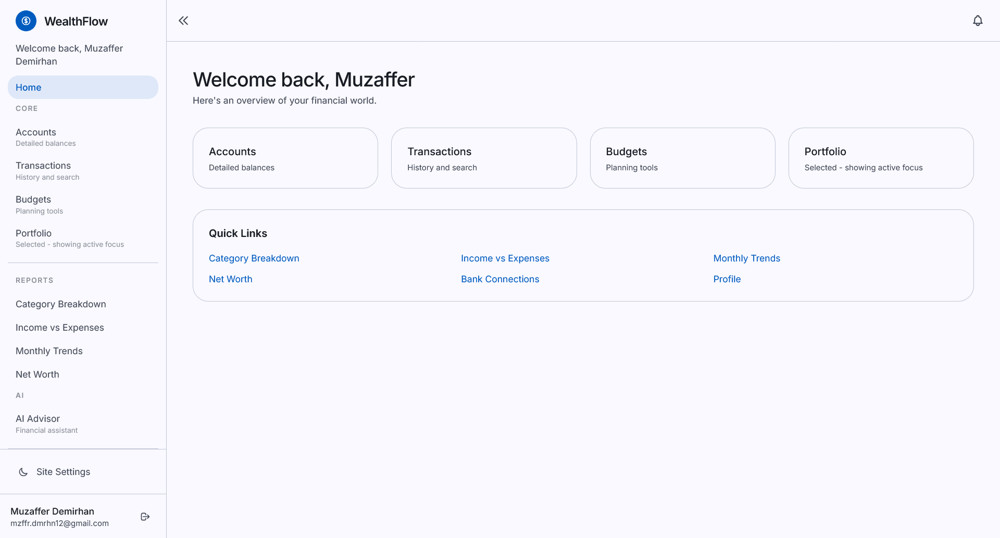
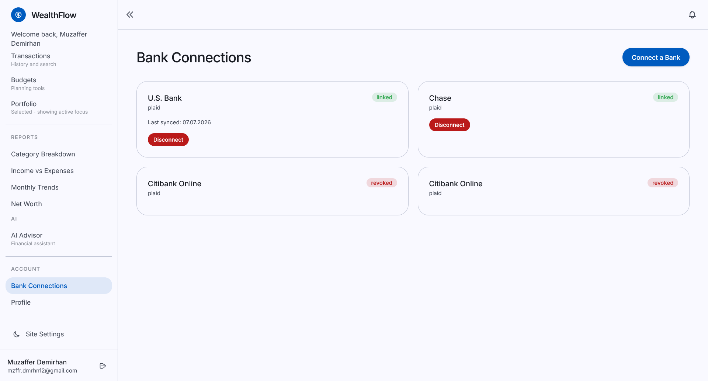
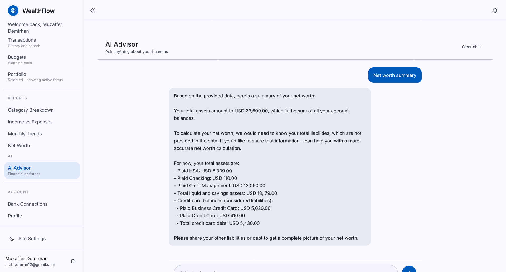
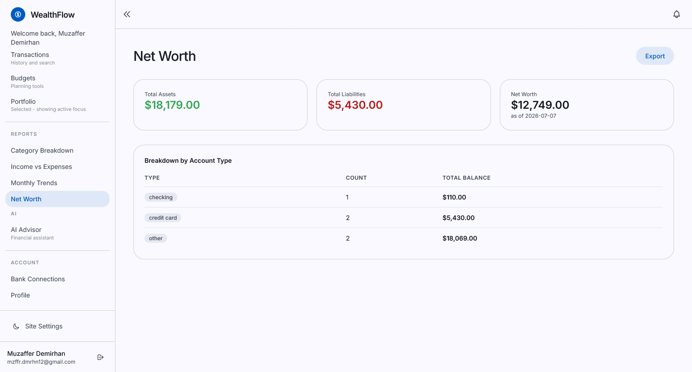
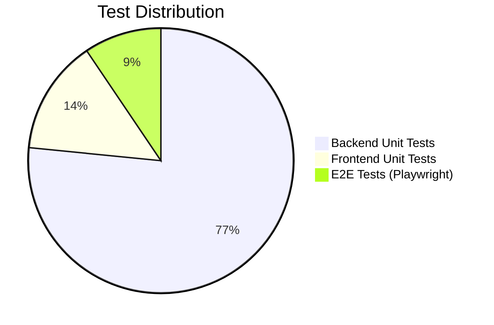

# WealthFlow

> A full-stack personal finance and investment tracking platform built for the European market.

[](https://github.com/MuzafferDemirhan/WealthFlow/actions)
[](LICENSE)


[](https://github.com/MuzafferDemirhan/WealthFlow/actions)
[](./docs/README.md)

---

## Description

WealthFlow is a full-stack personal finance and investment tracking platform. It connects to your bank accounts via Plaid (PSD2-compliant Open Banking), automatically categorizes transactions using a scikit-learn ML model, tracks your investment portfolio with real-time market data, and gives you an AI financial advisor powered by Groq LLM — all in one place.

Built with a FastAPI backend, Next.js 15 frontend, MS SQL Server database, and Celery for background sync jobs. Designed for the European market with multi-currency support.

**Core features:**
- 🏦 Bank account connection via Plaid (Open Banking)
- 🤖 Automatic transaction categorization (scikit-learn ML)
- 📈 Investment portfolio tracker with real-time prices
- 💰 Budget planning with smart alerts
- 💬 AI financial advisor chatbot (Groq / LLaMA)
- 📄 PDF & CSV report export
- 🔔 Real-time WebSocket notifications

---

## Demo

<!-- Record a 1-2 min GIF or Loom: login → connect bank (Plaid sandbox) → dashboard → transactions → AI chat -->
<!-- Save to docs/demo/demo.gif and uncomment the line below -->
<!-- [](./docs/demo/demo.gif) -->

> 🎬 **Live demo coming soon** — or run locally in 2 minutes with `docker compose up --build`

---

## Screenshots

<!-- Save screenshots to docs/screenshots/ and uncomment below -->
<!--





-->

> 📸 Screenshots coming soon

---

## Getting Started

### Dependencies

- [Docker Desktop](https://www.docker.com/products/docker-desktop/) — runs everything (DB, Redis, backend, frontend)
- Git

Optional (only if running without Docker):
- Python 3.12+
- Node.js 20+
- MS SQL Server 2022 + [ODBC Driver 18](https://learn.microsoft.com/en-us/sql/connect/odbc/download-odbc-driver-for-sql-server)
- Redis 7

Third-party API keys (all free tiers available):
- [Plaid](https://dashboard.plaid.com) — bank connections (sandbox needs no approval)
- [Groq](https://console.groq.com/keys) — AI chatbot
- [Alpha Vantage](https://www.alphavantage.co/support/#api-key) — portfolio market data

### Installing

1. Clone the repo:
```bash
git clone https://github.com/MuzafferDemirhan/WealthFlow.git
cd WealthFlow
```

2. Run the setup script — copies `.env.example` to `.env` for both backend and frontend:
```bash
# Windows
.\setup.ps1

# macOS / Linux
bash setup.sh
```

3. *(Optional)* Add your API keys to `backend/.env`:
```env
# Plaid — for bank account connection
PLAID_CLIENT_ID=your_client_id
PLAID_SECRET=your_secret

# Groq — for AI chatbot
LLM_API_KEY=your_groq_key

# Alpha Vantage — for portfolio prices
ALPHA_VANTAGE_KEY=your_key

# Token encryption key (required) — generate with:
# python -c "from cryptography.fernet import Fernet; print(Fernet.generate_key().decode())"
TOKEN_ENCRYPTION_KEY=your_generated_key
```

> Everything except bank syncing and AI chat works without API keys.

### Executing Program

Start all services with Docker Compose:
```bash
docker compose up --build
```

Open **http://localhost:3000** in your browser, register an account, and you're in.

To run database migrations manually:
```bash
docker compose exec backend alembic upgrade head
```

---

## Help

**Docker not starting?**
Make sure Docker Desktop is running before `docker compose up`.

**Bank connection not working?**
Plaid sandbox credentials: username `user_good`, password `pass_good`, phone OTP `1234`.

**AI chat not responding?**
Set `LLM_API_KEY` in `backend/.env` with a free [Groq key](https://console.groq.com/keys) and restart the backend.

**Port conflict?**
Change ports in `docker-compose.yml` — frontend defaults to `3000`, backend to `8000`.

```bash
# Run backend tests with coverage
docker compose exec backend pytest --cov=app --cov-report=term

# Run frontend tests
cd frontend && npm test
```

---

## Tech Stack

| Layer | Technology |
|-------|------------|
| Frontend | Next.js 15, TypeScript, Tailwind CSS, Recharts |
| Backend | FastAPI, Python 3.12, SQLAlchemy 2.0 |
| Database | MS SQL Server 2022 + Redis 7 |
| ML | scikit-learn (transaction classifier) |
| Task Queue | Celery + Redis |
| Auth | JWT (python-jose) + OAuth2 |
| DevOps | Docker, Docker Compose, GitHub Actions |

---

## System Architecture


> Code-based version: [architecture.md](./docs/architecture/architecture.md)

---

## Entity-Relationship Diagram


> Code-based version: [erd.md](./docs/ER%20diagram/erd.md)

---

## Project Structure

```
wealthflow/
├── backend/
│   ├── app/
│   │   ├── api/          # Route handlers
│   │   ├── core/         # Config, security, dependencies
│   │   ├── models/       # SQLAlchemy models
│   │   ├── schemas/      # Pydantic schemas
│   │   ├── services/     # Business logic
│   │   ├── tasks/        # Celery background jobs
│   │   └── ml/           # Transaction classifier
│   ├── migrations/       # Alembic DB migrations
│   └── tests/            # 219 tests
├── frontend/
│   └── src/
│       ├── app/          # Next.js App Router pages
│       ├── components/   # Reusable UI components
│       └── lib/          # API client, utilities
├── docs/
│   ├── SRS/              # Software Requirements Specification
│   ├── architecture/     # System architecture diagrams
│   └── ER diagram/       # Entity Relationship diagrams
├── docker-compose.yml
└── .github/workflows/    # CI/CD pipelines
```

---

## Test Distribution



---

## Documentation

- [Documentation Index](./docs/README.md)
- [SRS](./docs/SRS/SRS.md) — Software Requirements Specification
- [Architecture](./docs/architecture/architecture.md) — system architecture (Mermaid)
- [ER Diagram](./docs/ER%20diagram/erd.md) — database schema (Mermaid)
- [Sprint Summaries](./docs/README.md#sprint-summaries) — sprint-0 through sprint-4

---

## Version History

- **v0.4** — AI chatbot (Groq), PDF/CSV export, WebSocket notifications
- **v0.3** — Frontend dashboard (14 pages, Plaid connect flow, charts)
- **v0.2** — Plaid Open Banking, ML transaction classifier, portfolio tracker, reports
- **v0.1** — Backend core (auth, accounts, categories, budgets, transactions, CI/CD)

---

## Authors

**Muzaffer Demirhan**
- GitHub: [@MuzafferDemirhan](https://github.com/MuzafferDemirhan)

---

## License

This project is licensed under the MIT License — see the [LICENSE](LICENSE) file for details.

---

## Acknowledgments

- [Plaid](https://plaid.com) — Open Banking API
- [Groq](https://groq.com) — Fast LLM inference
- [FastAPI](https://fastapi.tiangolo.com) — Python web framework
- [Next.js](https://nextjs.org) — React framework
- [scikit-learn](https://scikit-learn.org) — ML transaction classifier
