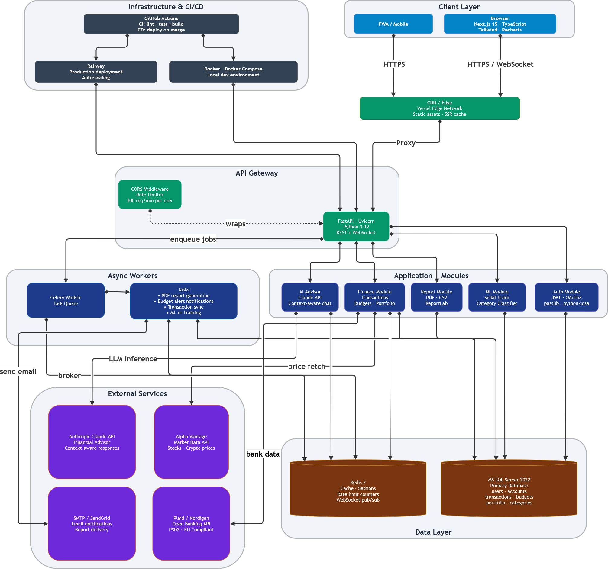
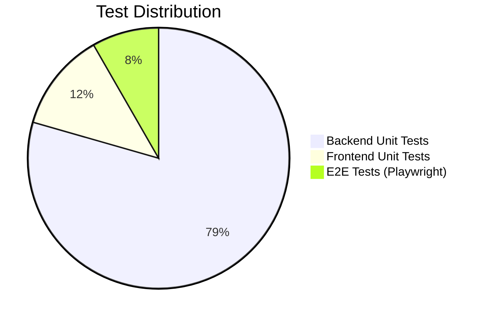

# WealthFlow 

> A full-stack personal finance and investment tracking platform built for the European market.

[](https://github.com/MuzafferDemirhan/WealthFlow/actions)
[](LICENSE)


[]()
[](./docs/README.md)

---

## What is this?

WealthFlow connects your bank accounts, tracks your spending with ML-powered categorization and monitors your investment portfolio in one place. Built with a PSD2-compliant Open Banking integration, it targets the European financial ecosystem.

**Core features:**
-  Bank account connection via Plaid (PSD2-compliant Open Banking)
-  Automatic transaction categorization (scikit-learn ML model)
-  Investment portfolio tracker with real-time market data
-  Budget planning with smart alerts
-  AI financial advisor chatbot
-  PDF & CSV report export

---

## Tech Stack

| Layer | Technology |
|-------|------------|
| Frontend | Next.js 15, TypeScript, Tailwind CSS, Recharts |
| Backend | FastAPI, Python 3.12, SQLAlchemy 2.0 |
| Database | MS SQL Server 2022 + Redis 7 |
| ML | scikit-learn (transaction classifier) |
| Task Queue | Celery + Redis |
| Auth | JWT (python-jose) + OAuth2 |
| DevOps | Docker, Docker Compose, GitHub Actions |
| Deployment | Railway |

---

## System Architecture



> **Note:** You can access the code-based version of the architecture in the [architecture.md](./docs/architecture/architecture.md) file.

---

## Entity-Relationship Diagram


> **Note:** You can access the code-based version of the architecture in the [erd.md](./docs/ER%20diagram/erd.md) file.

---

## Quick Start

```bash
git clone https://github.com/MuzafferDemirhan/WealthFlow.git
cd WealthFlow

# Windows
.\setup.ps1
# macOS / Linux
# bash setup.sh

docker compose up --build
```

Open **http://localhost:3000** — register an account and you're in.

> **AI chat** needs a free [Groq API key](https://console.groq.com/keys): set `LLM_API_KEY` in `backend\.env` after setup.  
> **Plaid keys** are optional — everything except bank syncing works without them.

### CI (forks)

CI pipelines don't require any secrets — tests mock all third-party APIs.  
If you want deploy to work, add `RAILWAY_TOKEN` in **Settings → Secrets and variables → Actions**.

### Run tests
```bash
# Backend
docker compose exec backend pytest --cov=app --cov-report=term

# Frontend
cd frontend && npm test
```

---

## Project Structure

```
wealthflow/
├── backend/
│   ├── app/
│   │   ├── api/          # Route handlers
│   │   ├── core/         # Config, security, dependencies
│   │   ├── models/       # SQLAlchemy models
│   │   ├── schemas/      # Pydantic schemas
│   │   └── services/     # Business logic
│   ├── alembic/          # DB migrations
│   └── tests/
├── frontend/
│   └── src/
│       ├── app/          # Next.js App Router pages
│       ├── components/   # Reusable UI components
│       └── lib/          # API client, utilities
├── docs/
│   ├── README.md          # Documentation index
│   ├── sprint-0.md        # Sprint summaries
│   ├── sprint-1.md
│   ├── sprint-2.md
│   ├── sprint-3.md
│   ├── SRS/               # Software Requirements Specification
│   ├── architecture/      # System architecture diagrams
│   └── ER diagram/        # Entity Relationship diagrams
├── docker-compose.yml
└── .github/workflows/    # CI/CD pipelines
```

---

## Test Distribution



---

## Documentation

- [Documentation Index](./docs/README.md) — central hub for all docs
- [SRS](./docs/SRS/SRS.md) — Software Requirements Specification
- [Sprint Summaries](./docs/README.md#sprint-summaries) — sprint-0 through sprint-3
- [Architecture](./docs/architecture/architecture.md) — system architecture (Mermaid)
- [ER Diagram](./docs/ER%20diagram/erd.md) — database schema (Mermaid)

---

## Roadmap

| Sprint | Status | Description |
|--------|--------|-------------|
| Sprint 0 | ✅ | Project scaffolding (Docker, DB, CI/CD, SRS) |
| Sprint 1 | ✅ | Backend core (auth, accounts, categories, budgets, transactions) |
| Sprint 2 | ✅ | Open Banking + ML classifier + portfolio + reports + connect |
| Sprint 3 | ✅ | Frontend dashboard (14 pages, 40 unit + 15 E2E tests) |
| Sprint 4 | ✅ | AI chatbot (Groq) + PDF/CSV export + WebSockets + deploy config |

> See [sprint-0.md](./docs/sprint-0.md), [sprint-1.md](./docs/sprint-1.md), [sprint-2.md](./docs/sprint-2.md), [sprint-3.md](./docs/sprint-3.md), [sprint-4.md](./docs/sprint-4.md) for details.

---

## License

MIT © [Muzaffer Demirhan](https://github.com/MuzafferDemirhan)
