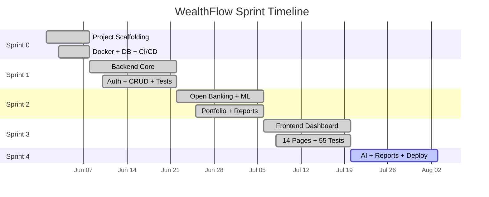
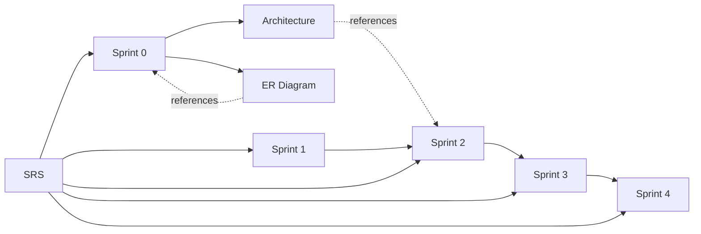

# WealthFlow Documentation

Central hub for all WealthFlow project documentation.

---

## Sprint Timeline

---

## Quick Navigation

| Document | Description | Status |
|----------|-------------|--------|
| [SRS](./SRS/SRS.md) | Software Requirements Specification | ✅ v1.1.0 |
| [Architecture](./architecture/architecture.md) | System architecture diagram (Mermaid) | ✅ |
| [ER Diagram](./ER%20diagram/erd.md) | Database entity relationship diagram (Mermaid) | ✅ |
| [sprint-0.md](./sprint-0.md) | Project scaffolding, Docker, CI/CD | ✅ |
| [sprint-1.md](./sprint-1.md) | Backend core: auth, accounts, budgets, transactions | ✅ |
| [sprint-2.md](./sprint-2.md) | Open Banking, ML classifier, portfolio, reports | ✅ |
| [sprint-3.md](./sprint-3.md) | Next.js frontend, 14 pages, 55 tests | ✅ |
| [sprint-4.md](./sprint-4.md) | AI chatbot (Ollama), export, WebSockets, Railway deploy | 🔄 Active |

---

## Document Relationships

---

## How to Use This Documentation

1. **Start here** — get an overview of the project and its sprint structure
2. **Read the SRS** — understand requirements, scope, and tech stack
3. **Follow sprint docs** — each sprint builds on the previous one
4. **View architecture/ERD** — for system and database design details

---

## Related

- [Root Project README](../README.md)
- [Frontend README](../frontend/README.md)
