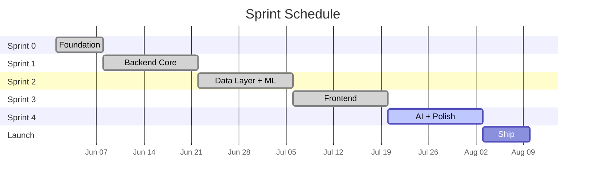

# Software Requirements Specification
## WealthFlow - Personal Finance & Investment Platform

### Document Control
| Version | Description of Change | Author | Date |
|---------|-----------------------|--------|------|
| 1.0.0 | First draft including core functional requirements and system architecture. | Muzaffer Demirhan | 29.06.2026 |
| 1.1.0 | Reformatted document structure for improved readability. Added System Architecture and ER Diagram. | Muzaffer Demirhan | 30.06.2026 |

**Date:** 2026-06-29  
**Status:** Working in Progress (WIP) Draft  

---

## 1. Introduction
### 1.1 Purpose
This document defines the software requirements for WealthFlow, a full-stack personal finance and investment tracking platform.
It serves as the single source of truth for all development decisions and is updated iteratively as the project evolves.

### 1.2 Scope
WealthFlow allows users to:
- Connect bank accounts via Open Banking APIs (Plaid/Nordigen)
- Automatically categorize transactions using a machine learning classifier
- Track investment portfolios (stocks, crypto, funds)
- Set budgets and receive real-time alerts
- Get AI-powered financial advice via a chatbot
- Export reports as PDF or CSV

### 1.3 Target Audience
- **Primary users:** Professionals aged 25 - 40 managing multiple income streams and investments
- **Market:** EU/Poland (PSD2-compliant Open Banking)

### 1.4 Definitions
| Term | Definition |
|------|------------|
| Open Banking | Standart allowing third-party access to bank data via APIs under PSD2. |
| PSD2 | EU Payment Services Directive 2 - mandates Open Banking. |
| JWT | JSON Web Token - stateless authentication mechanism. |
| ML | Machine Learning model for transaction classification. |

## 2. Overall Description
### 2.1 Product Perspective
WealthFlow is a standalone web application with a REST API backend. It integrates with:
- **Plaid / Nordigen** for bank account data.
- **Alpha Vantage / Yahoo Finance** for market data.
- **Anthropic Claude API** for the AI financial advisor chatbot.

### 2.2 User Classes
| User Class | Description |
|------------|-------------|
| Authenticated User | Full access to all features. |
| Guest | Landing page only, no data access. |
| Admin | User management, system monitoring. |

### 2.3 Operating Environment
- **Frontend:** Modern browsers (Chrome 120+, Firefox 120+, Safari 17+)
- **Backend:** Linux (Ubuntu 22.04 LTS) via Docker
- **Database:** MS SQL Server 2022
- **Deployment:** Railway (MVP), scalable to AWS/GCP

## 3. Functional Requirements

### 3.1 Authentication & Authorization
| ID | Requirement | Priority |
|----|-------------|----------|
| FR-01 | User registration with email + password | High |
| FR-01 | Login with JWT access + refresh tokens | High |
| FR-03 | Oauth2 social login (Google) | Medium |
| FR-04 | Password reset via email | Medium |
| FR-05 | Role-based access control (user/admin) | High |

### 3.2 Bank Account Integration
| ID | Requirement | Priority |
|----|-------------|----------|
| FR-06 | Connect bank accounts via Plaid Link / Nordigen | High |
| FR-07 | Fetch and store transaction history (90 days) | High |
| FR-08 | Real-time balance updates via webhooks | Medium |
| FR-09 | Support multiple accounts per user | High |
| FR-10 | Disconnect account and delete associated data | High |

### 3.3 Transaction Management
| ID | Requirement | Priority |
|----|-------------|----------|
| FR-11 | Auto-categorize transactions using ML model | High |
| FR-12 | Manual category override by user | High |
| FR-13 | Search and filter transactions | Medium |
| FR-14 | Add manual transactions (cash) | Low |
| FR-15 | Recurring transaction detection | Medium |

### 3.4 Dashboard & Analytics
| ID | Requirement | Priority |
|----|-------------|----------|
| FR-16 | Monthly income vs expense chart | High |
| FR-17 | Spending breakdown by category (pie/donut chart) | High |
| FR-18 | Net worth over time (line chart) | High |
| FR-19 | Cash flow heatmap (daily spending) | Medium |
| FR-20 | Saving rate calculation | Medium |

### 3.5 Budget Management
| ID | Requirement | Priority |
|----|-------------|----------|
| FR-21 | Create monthly budgets per category | High |
| FR-22 | Progress bar tracking against budget | High |
| FR-23 | Push notification when 80% of budget used | Medium |
| FR-24 | Budget history and comparison | Low |

### 3.6 Investment Portfolio
| ID | Requirement | Priority |
|----|-------------|----------|
| FR-25 | Add holdings (ticker, shares, purchase price) | High |
| FR-26 | Real-time price fetch from market API | High |
| FR-27 | Portfolio performance (P&L, %) | High |
| FR-28 | Asset allocation pie chart | Medium |
| FR-29 | Historical portfolio value chart | Medium |

### 3.7 AI Financial Advisor
| ID | Requirement | Priority |
|----|-------------|----------|
| FR-30 | Chatbot powered by Claude API | Medium |
| FR-31 | Context-aware (knows user's transactions/budgets) | Medium |
| FR-32 | Suggest savings opportunities | Low |
| FR-33 | Persistent chat history | Low |

### 3.8 Reports & Export
| ID | Requirement | Priority |
|----|-------------|----------|
| FR-34 | Monthly PDF report generation | Medium |
| FR-35 | CSV export of transactions | Medium |
| FR-36 | Email delivery of reports | Low |

## 4. Non-Functional Requirements
| ID | Requirement | Target |
|----|-------------|--------|
| NFR-01 | API respons time (p95) | < 200ms |
| NFR-02 | Uptime SLA | 99.9% |
| NFR-03 | Data encryption at rest | AES-256 |
| NFR-04 | Data encryption in transit | TLS 1.3 |
| NFR-05 | GDPR compliance | Full deletion & export |
| NFR-06 | OWASP Top 10 | All mitigated |
| NFR-07 | Lighthouse performance score | > 90 |
| NFR-08 | Mobile responsive | All breakpoints |
| NFR-09 | Test coverage | > 80% (unit + integration) |
| NFR-10 | API rate limiting | 100 req/min per user |

## 5. System Architecture

See the [System Architecture Diagram](../architecture/architecture.md) (Mermaid code) or the [PNG version](../architecture/WealthFlow_SystemArchitecture.png) for a comprehensive infrastructure and CI/CD map covering the Client Layer, API Gateway, Async Workers, App Modules, Data Layer, and External Services.

## 6. Database Schema
### 6.1 Entity Relationship Diagram

See the [ER Diagram](../ER%20diagram/erd.md) (Mermaid code) or the [PNG version](../ER%20diagram/WealthFlow_ERDiagram.png) for the complete entity relationship model.

### 6.2 Core Tables
These are SQL codes that has been created within MS SQL Server 2022.

#### User Table
| Column Name | Data Type | Constraints |
|-------------|-----------|-------------|
| id | UNIQUEIDENTIFIER | PRIMARY KEY DEFAULT NEWID() |
| email | VARCHAR(255) | UNIQUE NOT NULL |
| hashed_pw | VARCHAR(255) | |
| full_name | VARCHAR(255) | |
| is_active | BIT | DEFAULT 1 |
| is_admin | BIT | DEFAULT 0 |
| created_at | DATETIME2 | DEFAULT GETUTCDATE() |
| updated_at | DATETIME2 | DEFAULT GETUTCDATE() |

#### Category Table
| Column Name | Data Type | Constraints |
|-------------|-----------|-------------|
| id | UNIQUEIDENTIFIER | PRIMARY KEY DEFAULT NEWID() |
| name | VARCHAR(100) | NOT NULL |
| icon | VARCHAR(50) | |
| color | VARCHAR(7) | |
| is_default | BIT | DEFAULT 0 |

#### Bank Account Table
| Column Name | Data Type | Constraints |
|-------------|-----------|-------------|
| id | UNIQUEIDENTIFIER | PRIMARY KEY DEFAULT NEWID() |
| user_id | UNIQUEIDENTIFIER | REFERENCES users(id) ON DELETE CASCADE |
| provider | VARCHAR(50) | NOT NULL |
| external_id | VARCHAR(255) | NOT NULL |
| institution | VARCHAR(255) | |
| account_type | VARCHAR(50) | checking, savings, credit |
| balance | DECIMAL(15,2) | |
| currency | VARCHAR(3) | DEFAULT 'PLN' |
| last_synced_at | DATETIME2 | |
| created_at | DATETIME2 | DEFAULT GETUTCDATE() |

#### Transaction Table
| Column Name | Data Type | Constraints |
|-------------|-----------|-------------|
| id | UNIQUEIDENTIFIER | PRIMARY KEY DEFAULT NEWID() |
| account_id | UNIQUEIDENTIFIER | REFERENCES accounts(id) ON DELETE CASCADE |
| external_id | VARCHAR(255) | UNIQUE |
| amount | DECIMAL(15,2) | NOT NULL |
| currency | VARCHAR(3) | DEFAULT 'PLN' |
| description | VARCHAR(MAX) | |
| category_id | UNIQUEIDENTIFIER | REFERENCES categories(id) |
| is_manual | BIT | DEFAULT 0 |
| date | DATE | NOT NULL |
| created_at | DATETIME2 | DEFAULT GETUTCDATE() |

#### Budget Table
| Column Name | Data Type | Constraints |
|-------------|-----------|-------------|
| id | UNIQUEIDENTIFIER | PRIMARY KEY DEFAULT NEWID() |
| user_id | UNIQUEIDENTIFIER | REFERENCES users(id) ON DELETE CASCADE |
| category_id | UNIQUEIDENTIFIER | REFERENCES categories(id) |
| amount | DECIMAL(15,2) | NOT NULL |
| period | VARCHAR(20) | DEFAULT 'monthly' |
| created_at | DATETIME2 | DEFAULT GETUTCDATE() |

#### Portfolio Holding Table
| Column Name | Data Type | Constraints |
|-------------|-----------|-------------|
| id | UNIQUEIDENTIFIER | PRIMARY KEY DEFAULT NEWID() |
| user_id | UNIQUEIDENTIFIER | REFERENCES users(id) ON DELETE CASCADE |
| ticker | VARCHAR(20) | NOT NULL |
| shares | DECIMAL(15,6) | NOT NULL |
| avg_cost | DECIMAL(15,2) | NOT NULL |
| asset_type | VARCHAR(20) | stock, crypto, etf, fund |
| created_at | DATETIME2 | DEFAULT GETUTCDATE() |

## 7. API Specification
**Base URL:** /api/v1

### Authentication
| Method | Endpoint | Description |
|--------|----------|-------------|
| POST | /auth/register | Register new user |
| POST | /auth/login | Login, returns JWT pair |
| POST | /auth/refresh | Refresh access token |
| POST | /auth/logout | Invalidate refresh token |
| POST | /auth/password-reset | Send reset email |

### Account
| Method | Endpoint | Description |
|--------|----------|-------------|
| GET | /account | List user's connected accounts |
| POST | /account/connect | Initiate Open Banking connection |
| DELETE | /account/{id} | Disconnect account |
| GET | /account/{id}/sync | Force sync transactions |

### Transaction
| Method | Endpoint | Description |
|--------|----------|-------------|
| GET | /transaction | List (filter: date, category, account) |
| GET | /transaction/{id} | Get single transaction |
| PATCH | /transaction/{id} | Update category |
| POST | /transaction | Create manual transaction |

### Budget
| Method | Endpoint | Description |
|--------|----------|-------------|
| GET | /budget | List budgets with progress |
| POST | /budget | Create budget |
| PUT | /budget/{id} | Update budget |
| DELETE | /budget/{id} | Delete budget |

### Portfolio
| Method | Endpoint | Description |
|--------|----------|-------------|
| GET | /portfolio | Holdings with current prices + P&L |
| POST | /portfolio/holding | Add holding |
| DELETE | /portfolio/holding/{id} | Remove holding |

### Report
| Method | Endpoint | Description |
|--------|----------|-------------|
| GET | /report/monthly | Monthly summary (JSON) |
| GET | /report/pdf | Download PDF report |
| GET | /report/csv | Download transactions CSV |

## 8. Tech Stack
| Layer | Technology | Rationale |
|-------|------------|-----------|
| Frontend | Next.js 15 + TypeScript | SSR, type safety, strong EU job market demand |
| Styling | Tailwind CSS | Rapid UI development |
| Charts | Recharts | React-native charting |
| Backend | FastAPI (Python 3.12) | Async, auto-docs, ML-friendly |
| ORM | SQLAlchemy 2.0 + Alembic | Type-safe queries, migrations |
| Database | MS SQL Server 2022 | ACID, JSON support, mature |
| Cache | Redis 7 | Session store, rate limiting |
| Task Queue | Celery + Redis broker | Async jobs (reports, notifications) |
| ML | scikit-learn | Transaction classifier |
| Auth | JWT + python-jose | Stateless, scalable |
| Containerization | Docker + Docker Compose | Reproducible environments |
| CI/CD | Github Actions | Automated test + deploy |
| Deployment | Railway | Simple PaaS, free tier |
| Testing | pytest + React Testing Library | >80% coverage target |

## 9. Sprint Timeline

## 10. Scrum Plan

### Sprint 0 — Foundation (Week 1) ✅
See [sprint-0.md](../sprint-0.md) for details.
- [x] SRS document
- [x] System architecture diagram
- [x] Database ERD
- [x] Project scaffolding (repo structure, Docker Compose)

### Sprint 1 — Backend Core (Weeks 2-3) ✅
See [sprint-1.md](../sprint-1.md) for details.
- [x] FastAPI project setup with folder structure
- [x] MS SQL Server 2022 + Alembic migrations
- [x] User model + JWT auth endpoints
- [x] Docker Compose (FastAPI + MS SQL Server 2022 + Redis)
- [x] GitHub Actions CI (lint + test)

### Sprint 2 — Data Layer (Weeks 4-5) ✅
See [sprint-2.md](../sprint-2.md) for details.
- [x] Nordigen integration (sandbox)
- [x] Transaction ingestion pipeline
- [x] ML classifier for categories (scikit-learn)
- [x] Celery worker setup
- [x] REST endpoints: accounts, transactions, budgets, portfolio, reports, connect

### Sprint 3 — Frontend (Weeks 6-7) ✅
See [sprint-3.md](../sprint-3.md) for details.
- [x] Next.js project setup + Tailwind
- [x] Auth pages (login, register)
- [x] Dashboard with Recharts
- [x] 14 pages (accounts, transactions, budgets, portfolio, reports, connect, profile)
- [x] 55 tests (40 unit + 15 E2E)

### Sprint 4 — AI & Polish (Week 8) ⬜
- [ ] Claude API chatbot integration
- [ ] WebSocket notifications
- [ ] PDF report generation (ReportLab)
- [ ] Railway deployment
- [ ] End-to-end tests

### Launch (Week 9) ⬜
- [ ] English README with screenshots
- [ ] Demo GIF
- [ ] GitHub profile pinning
- [ ] LinkedIn post

## 11. Risks & Mitigations
| Risk | Likelihood | Impact | Mitigation |
|------|------------|--------|------------|
| Open Banking API rate limits | Medium | High | Cache responses in Redis, use webhooks |
| ML classifier low accuracy | Medium | Medium | Start with rule-based fallback |
| GDPR non-compliance | Low | High | Encrypt PII, implement data deletion |
| Railway downtime | Low | Medium | Health checks, auto-restart |
| Scope creep | High | Medium | Strict sprint backlog, MoSCoW prioritization |