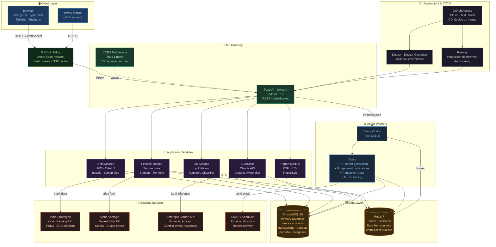

```mermaid
flowchart TD
    %% ─── CLIENTS ───────────────────────────────────────────────
    subgraph CLIENT["🖥️  Client Layer"]
        direction LR
        BROWSER["Browser\nNext.js 15 · TypeScript\nTailwind · Recharts"]
        PWA["PWA / Mobile\n(v2 Roadmap)"]
    end

    %% ─── CDN / EDGE ────────────────────────────────────────────
    CDN["🌐 CDN / Edge\nVercel Edge Network\nStatic assets · SSR cache"]

    %% ─── API GATEWAY ───────────────────────────────────────────
    subgraph GATEWAY["⚡ API Gateway"]
        direction LR
        FASTAPI["FastAPI · Uvicorn\nPython 3.12\nREST + WebSocket"]
        CORS["CORS Middleware\nRate Limiter\n100 req/min per user"]
    end

    %% ─── APPLICATION MODULES ────────────────────────────────────
    subgraph APP["🧩 Application Modules"]
        direction LR
        AUTH["Auth Module\nJWT · OAuth2\npasslib · python-jose"]
        FINANCE["Finance Module\nTransactions\nBudgets · Portfolio"]
        ML["ML Module\nscikit-learn\nCategory Classifier"]
        REPORT["Report Module\nPDF · CSV\nReportLab"]
        CHAT["AI Advisor\nClaude API\nContext-aware chat"]
    end

    %% ─── DATA LAYER ─────────────────────────────────────────────
    subgraph DATA["🗄️  Data Layer"]
        direction LR
        PG[("PostgreSQL 16\nPrimary Database\nusers · accounts\ntransactions · budgets\nportfolio · categories")]
        REDIS[("Redis 7\nCache · Sessions\nRate limit counters\nWebSocket pub/sub")]
    end

    %% ─── ASYNC WORKERS ──────────────────────────────────────────
    subgraph WORKERS["⚙️  Async Workers"]
        direction LR
        CELERY["Celery Worker\nTask Queue"]
        TASKS["Tasks\n• PDF report generation\n• Budget alert notifications\n• Transaction sync\n• ML re-training"]
    end

    %% ─── EXTERNAL SERVICES ──────────────────────────────────────
    subgraph EXT["🔌 External Services"]
        direction LR
        PLAID["Plaid / Nordigen\nOpen Banking API\nPSD2 · EU Compliant"]
        MARKET["Alpha Vantage\nMarket Data API\nStocks · Crypto prices"]
        CLAUDE["Anthropic Claude API\nFinancial Advisor\nContext-aware responses"]
        EMAIL["SMTP / SendGrid\nEmail notifications\nReport delivery"]
    end

    %% ─── INFRA / CI-CD ──────────────────────────────────────────
    subgraph INFRA["🚀 Infrastructure & CI/CD"]
        direction LR
        DOCKER["Docker · Docker Compose\nLocal dev environment"]
        GHA["GitHub Actions\nCI: lint · test · build\nCD: deploy on merge"]
        RAILWAY["Railway\nProduction deployment\nAuto-scaling"]
    end

    %% ─── CONNECTIONS ────────────────────────────────────────────
    BROWSER -- "HTTPS / WebSocket" --> CDN
    PWA     -- "HTTPS"             --> CDN
    CDN     -- "Proxy"             --> FASTAPI
    CORS    -. "wraps"             .-> FASTAPI

    FASTAPI --> AUTH
    FASTAPI --> FINANCE
    FASTAPI --> ML
    FASTAPI --> REPORT
    FASTAPI --> CHAT

    AUTH    --> PG
    FINANCE --> PG
    FINANCE --> REDIS
    ML      --> PG
    REPORT  --> PG
    CHAT    --> REDIS

    FASTAPI  -- "enqueue jobs" --> CELERY
    CELERY   --> TASKS
    TASKS    --> PG
    TASKS    --> REDIS
    CELERY   -- "broker"       --> REDIS

    FINANCE  -- "bank data"      --> PLAID
    FINANCE  -- "price fetch"    --> MARKET
    CHAT     -- "LLM inference"  --> CLAUDE
    TASKS    -- "send email"     --> EMAIL

    DOCKER  --> FASTAPI
    GHA     --> DOCKER
    GHA     --> RAILWAY
    RAILWAY --> FASTAPI

    %% ─── STYLES ─────────────────────────────────────────────────
    classDef clientStyle  fill:#1e3a5f,stroke:#378ADD,stroke-width:1.5px,color:#B5D4F4
    classDef gatewayStyle fill:#1a3a2a,stroke:#1D9E75,stroke-width:1.5px,color:#9FE1CB
    classDef appStyle     fill:#2a1a3a,stroke:#7F77DD,stroke-width:1.5px,color:#CECBF6
    classDef dataStyle    fill:#3a2a10,stroke:#BA7517,stroke-width:1.5px,color:#FAC775
    classDef workerStyle  fill:#1a2a3a,stroke:#378ADD,stroke-width:1px,color:#85B7EB
    classDef extStyle     fill:#2a1a1a,stroke:#D85A30,stroke-width:1.5px,color:#F5C4B3
    classDef infraStyle   fill:#1a1a2a,stroke:#5F5E5A,stroke-width:1px,color:#D3D1C7
    classDef cdnStyle     fill:#0f2a1a,stroke:#3B6D11,stroke-width:1px,color:#C0DD97

    class BROWSER,PWA clientStyle
    class FASTAPI,CORS gatewayStyle
    class AUTH,FINANCE,ML,REPORT,CHAT appStyle
    class PG,REDIS dataStyle
    class CELERY,TASKS workerStyle
    class PLAID,MARKET,CLAUDE,EMAIL extStyle
    class DOCKER,GHA,RAILWAY infraStyle
    class CDN cdnStyle
```
