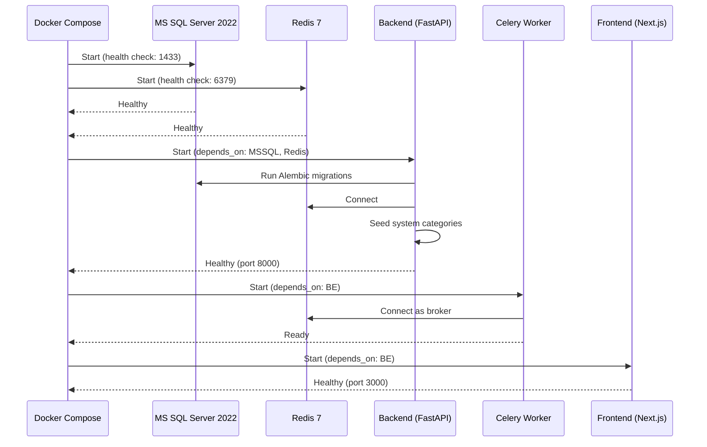
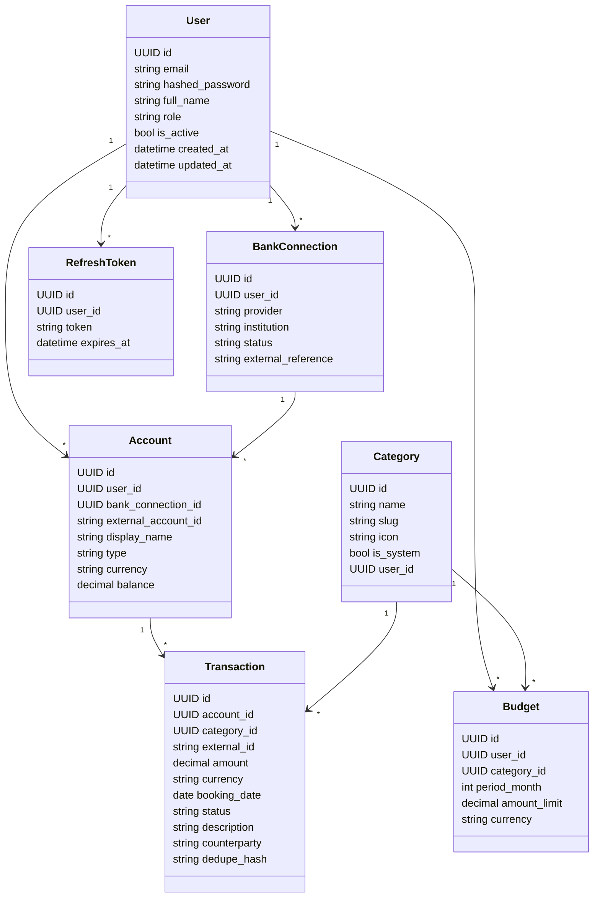

# Sprint 0 - Project Scaffolding

## Goal
Set up the full-stack project foundation: Docker environment, database schema, CI/CD, and core application structure.

## Docker Compose Startup Flow

## Core Data Models

## Deliverables

### Docker Infrastructure

| Service | Image | Port | Health Check |
|---------|-------|------|-------------|
| **MS SQL Server 2022** | `mcr.microsoft.com/mssql/server:2022-latest` | 1433 | `pg_isready`-style SQL query |
| **Redis 7** | `redis:7-alpine` | 6379 | `redis-cli ping` |
| **Backend (FastAPI)** | Custom Dockerfile | 8000 | `GET /health` |
| **Frontend (Next.js)** | Custom Dockerfile | 3000 | HTTP 200 on `/` |

- Volume mounts for persistent DB data
- Dependency ordering via `depends_on` + health checks

### Backend Scaffolding (`backend/`)
| Component | Technology | Purpose |
|-----------|-----------|---------|
| Web Framework | FastAPI | REST API with auto-docs |
| ORM | SQLAlchemy 2.0 | Type-safe queries |
| Migrations | Alembic | Autogenerate-enabled |
| Settings | Pydantic v2 | `.env` file support |
| Cache | Redis via `redis-py` | Session store, rate limiting |
| Task Queue | Celery + Redis | Async job processing |
| CORS | FastAPI middleware | Frontend origin allowlist |
| Health Check | `GET /health` | Docker readiness probe |

### Initial Data Models
- `User` (id, email, hashed_password, full_name, role, is_active)
- `Category` (id, name, slug, icon, is_system, user_id)
- `BankConnection` (id, user_id, provider, institution, status, external_reference)
- `Account` (id, user_id, bank_connection_id, external_account_id, display_name, type, currency, balance)
- `Transaction` (id, account_id, category_id, external_id, amount, currency, booking_date, status, description, counterparty)
- `Budget` (id, user_id, category_id, period_month, amount_limit, currency)
- `RefreshToken` (id, user_id, token, expires_at)

### CI/CD Pipeline

| Stage | Tool | Description |
|-------|------|-------------|
| Lint | `ruff` | Python linting (select E, F, I) |
| Type Check | `pyright` | Static type checking |
| Test | `pytest` | Run backend test suite |
| Build | Docker | Build backend + frontend images |

### Project Documentation
- [Software Requirements Specification](../SRS/SRS.md)
- [System Architecture Diagram](../architecture/architecture.md)
- [ER Diagram](../ER%20diagram/erd.md)

## Sprint 0 Completion Checklist

- [x] `docker-compose.yml` with all 4 services
- [x] Multi-stage Dockerfiles for backend and frontend
- [x] FastAPI app with lifespan + health check
- [x] SQLAlchemy 2.0 Base + UUID/timestamp mixins
- [x] Alembic migrations (autogenerate)
- [x] Pydantic v2 settings with `.env` support
- [x] Redis + Celery integration
- [x] CORS middleware
- [x] All 7 initial data models
- [x] GitHub Actions CI (lint + type-check + test + build)
- [x] SRS + Architecture + ERD documentation

## Key Decisions
| Decision | Choice | Rationale |
|----------|--------|-----------|
| Primary Database | MS SQL Server 2022 | ACID, JSON support, mature |
| Test Database | SQLite in-memory | Fast, isolated, no external deps |
| SQLAlchemy Engine | Sync (not async) | pyodbc/aioodbc async stack is immature |
| Linter | ruff | Fast, modern Python linter |
| Auth Tokens | JWT pair (access + refresh) | Stateless, scalable |
| JWT Library | python-jose | Mature, well-supported |
