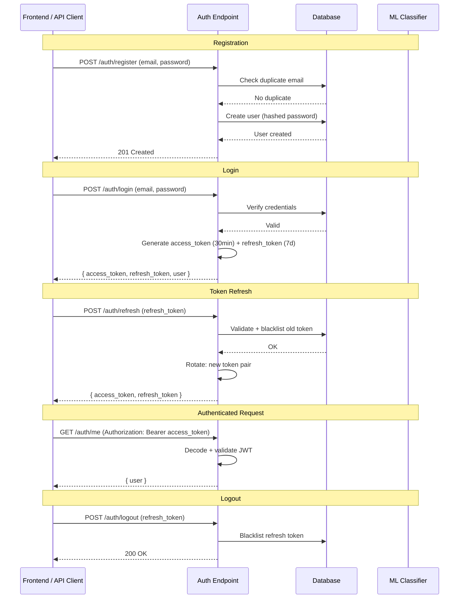
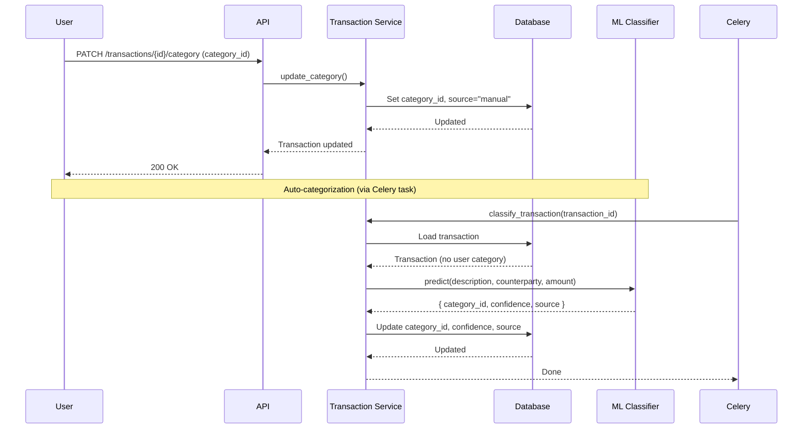

# Sprint 1 - Backend Core (Auth, Accounts, Categories, Budgets, Transactions)

## Goal
Deliver the backend business logic and API endpoints for core personal finance features.

## Auth Flow

## Transaction Categorization Flow

## Deliverables

### Authentication (`/api/v1/auth`)

| Method | Endpoint | Description | Auth |
|--------|----------|-------------|------|
| POST | `/auth/register` | Register with email + password | No |
| POST | `/auth/login` | Login, returns JWT pair | No |
| GET | `/auth/me` | Current user profile | Yes |
| POST | `/auth/refresh` | Rotate refresh token | No* |
| POST | `/auth/logout` | Revoke refresh token | Yes |

\* Requires valid refresh token in request body

- Password hashing via **passlib** + **bcrypt**
- Tokens expire: 30 min (access), 7 days (refresh)
- Refresh token rotation with old-token blacklisting

### Categories (`/api/v1/categories`)

| Method | Endpoint | Description | Auth |
|--------|----------|-------------|------|
| GET | `/categories` | List all system categories | Yes |
| GET | `/categories/{slug}` | Get category by slug | Yes |

- Idempotent seeding of 12 system categories at startup
- Seeded categories: income, housing, groceries, dining, transport, utilities, healthcare, entertainment, shopping, education, transfers, other

### Accounts (`/api/v1/accounts`)

| Method | Endpoint | Description | Auth |
|--------|----------|-------------|------|
| GET | `/accounts` | List user accounts | Yes |
| GET | `/accounts/{id}` | Single account detail | Yes |
| DELETE | `/accounts/{id}` | Soft-delete (deactivate) | Yes |
| POST | `/accounts/{id}/sync` | Trigger Celery sync | Yes |

- Scoped to current authenticated user
- Soft-delete via `is_active` flag

### Budgets (`/api/v1/budgets`)

| Method | Endpoint | Description | Auth |
|--------|----------|-------------|------|
| POST | `/budgets` | Create budget | Yes |
| GET | `/budgets` | List with spending, remaining, progress % | Yes |
| PUT | `/budgets/{id}` | Update limit/category | Yes |
| DELETE | `/budgets/{id}` | Delete budget | Yes |

- Unique constraint per user + category + month
- Spending calculation per category per month

### Transactions (`/api/v1/transactions`)

| Method | Endpoint | Description | Auth |
|--------|----------|-------------|------|
| GET | `/transactions` | List with filters + pagination | Yes |
| GET | `/transactions/{id}` | Single transaction | Yes |
| PATCH | `/transactions/{id}/category` | Override category | Yes |
| POST | `/transactions/manual` | Create manual transaction | Yes |

- Filters: account, category, date range, status, search
- Pagination via limit + offset

### Data Model Enhancements
- `dedupe_hash` column on Transaction (SHA-256 of normalized fields, unique per account)
- `category_source` and `category_confidence` columns for ML tracking
- Auth token blacklisting via RefreshToken table
- `is_active` soft-delete on Account

## Test Summary

| Category | Count | Status |
|----------|-------|--------|
| Auth tests | 16 | ✅ All passing |
| Account tests | 10 | ✅ All passing |
| Category tests | 15 | ✅ All passing |
| Budget tests | 15 | ✅ All passing |
| Transaction tests | 20 | ✅ All passing |
| **Total** | **76** | ✅ |

> Note: Pre-existing `test_auth.py` failures (passlib/bcrypt compat) — not caused by Sprint 1

## Sprint 1 Completion Checklist

- [x] Auth endpoints: register, login, me, refresh, logout
- [x] Password hashing with passlib + bcrypt
- [x] JWT token pair with rotation + blacklisting
- [x] Category endpoints + startup seeding (12 categories)
- [x] Account endpoints with ownership scoping
- [x] Budget endpoints with spending computation
- [x] Transaction endpoints with filtering + pagination
- [x] Manual transaction creation
- [x] Data model enhancements (dedupe_hash, category_source, soft-delete)
- [x] 76 passing tests

## Key Decisions
| Decision | Choice | Rationale |
|----------|--------|-----------|
| Account Deletion | Soft-delete (`is_active`) | Preserve referential integrity |
| Budget Uniqueness | (user_id, category_id, period_month) | One budget per category per month |
| Dedup Hash | SHA-256 of normalized fields | Deterministic, collision-resistant |
| Pydantic | v2 with `from_attributes=True` | Modern, improved performance |
| Auth Token Lifetime | 30 min access / 7 days refresh | Security vs UX balance |
| Refresh Strategy | Rotation + old-token blacklist | Prevent token reuse on theft |
