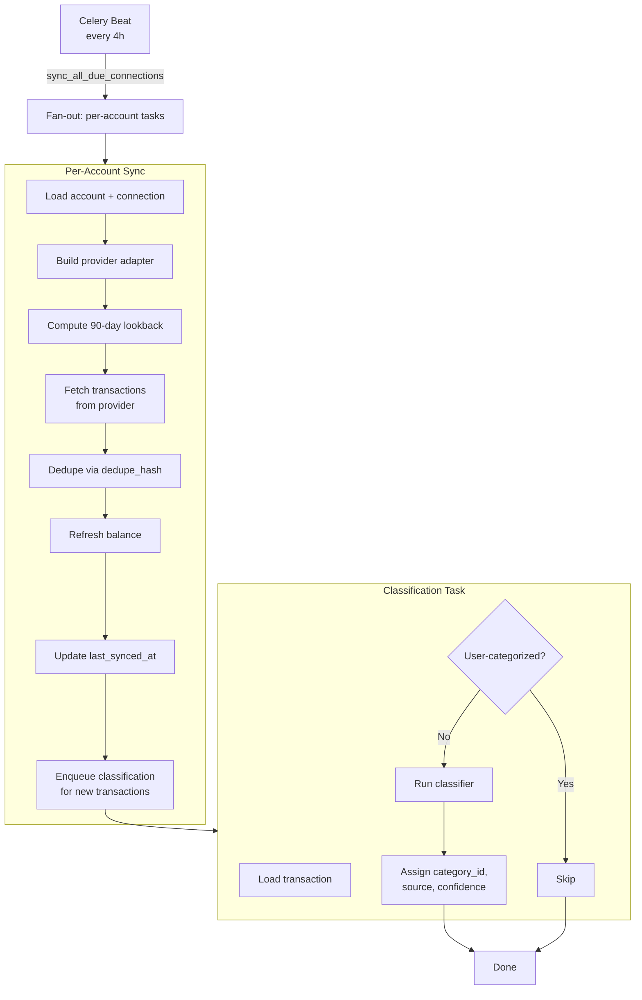
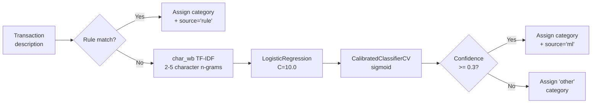
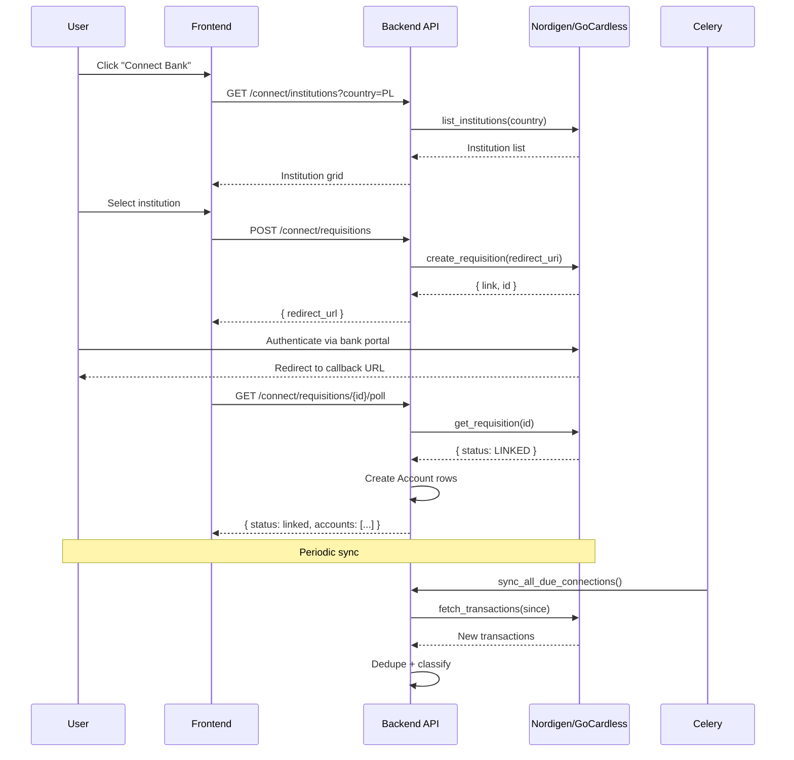

# Sprint 2 - Open Banking Integration, ML Classifier, Portfolio, Reports

## Goal
Deliver the transaction ingestion pipeline via GoCardless/Nordigen, ML-powered transaction categorization, portfolio tracking, financial reports, and a bank-connect endpoint.

## Transaction Ingestion Pipeline

## ML Classifier Pipeline

## Bank Connect Flow

## Deliverables

### 1. Provider Adapter Pattern (`app/services/providers/`)

| Component | File | Description |
|-----------|------|-------------|
| Abstract Base | `base.py` | `ProviderAdapter` ABC + `ProviderTransaction` dataclass |
| Nordigen Adapter | `nordigen.py` | Full Nordigen/GoCardless implementation |

**NordigenAdapter methods:**

| Method | Returns | Description |
|--------|---------|-------------|
| `fetch_accounts(requisition_id)` | `list[ProviderAccount]` | Maps Nordigen accounts |
| `fetch_transactions(account_id, since)` | `list[ProviderTransaction]` | Booked + pending |
| `fetch_balances(account_id)` | `(Decimal, datetime)` | Prefers `interimAvailable` |
| `create_requisition(institution_id, redirect_uri, reference)` | `dict` | Create requisition link |
| `get_requisition(requisition_id)` | `dict` | Poll requisition status |
| `list_institutions(country)` | `list` | Sorted institution listing |

- Token lifecycle: obtain, refresh, expire with 60s safety margin
- 401 auto-retry (refresh token + retry once)
- **35 tests** covering all adapter methods, edge cases, error handling, token expiry, data mapping

### 2. Transaction Ingestion Pipeline (`app/tasks/ingestion.py`)

**`sync_account_transactions(account_id)`** — per-account Celery task:

| Step | Action |
|------|--------|
| 1 | Load account + connection eagerly |
| 2 | Build provider adapter |
| 3 | Compute 90-day lookback from `last_synced_at` |
| 4 | Fetch raw transactions from provider |
| 5 | Dedupe via `dedupe_hash` unique constraint |
| 6 | Refresh balance from provider (non-fatal if fails) |
| 7 | Update `last_synced_at` |
| 8 | Enqueue classification for new transactions |

**`sync_all_due_connections()`** — periodic fan-out task (Celery Beat every 4h):
- Queries LINKED connections with `last_synced_at > 4h` or never synced
- Fans out to per-account sync tasks
- Celery Beat schedule configured in `app/core/celery_app.py`
- **14 tests** covering date computation, dedup, happy path, edge cases

### 3. ML Transaction Classifier (`app/ml/`)

| Component | Description |
|-----------|-------------|
| `seed_data.py` | 120 labeled Polish transactions across 12 categories (rule-based ground truth) |
| `classifier.py` | scikit-learn pipeline |

**Classifier pipeline:**

| Step | Algorithm | Purpose |
|------|-----------|---------|
| 1 | Keyword rules | Rule-based classification FIRST |
| 2 | `char_wb` TF-IDF | 2-5 character n-gram vectorizer |
| 3 | `LogisticRegression(C=10.0)` | Core classifier |
| 4 | `CalibratedClassifierCV(sigmoid)` | Probability calibration |
| 5 | Threshold filter | Confidence >= 0.3; below → "other" |

- Serialization support (dumps/loads)
- `train_default()` — trains on seed data
- `predict(description, counterparty_name, amount)` — rule + ML
- **30 tests** covering rules, ML, confidence, edge cases, serialization, DB integration

### 4. Classification Task (`app/tasks/classification.py`)

| Task | Description |
|------|-------------|
| `classify_transaction(transaction_id)` | Loads transaction, skips if user-categorized, runs classifier |
| `retrain_classifier()` | Resets and retrains the model |

### 5. Portfolio (`/api/v1/portfolio`)

**Data model:** `Holding` (symbol, name, asset_type, quantity, cost_basis, current_price, currency)

| Method | Endpoint | Description |
|--------|----------|-------------|
| GET | `/portfolio` | List user holdings |
| GET | `/portfolio/{id}` | Single holding |
| POST | `/portfolio` | Create holding |
| PUT | `/portfolio/{id}` | Update holding |
| DELETE | `/portfolio/{id}` | Delete holding |
| GET | `/portfolio/summary` | Market value, gain/loss, allocation % |

- **22 tests** covering CRUD, summary computation, ownership scoping

### 6. Reports (`/api/v1/reports`)

| Endpoint | Service Function | Description |
|----------|-----------------|-------------|
| `GET /reports/category-breakdown` | `get_category_breakdown` | Spending by category (optional account filter) |
| `GET /reports/income-vs-expenses` | `get_income_vs_expenses` | Totals or monthly breakdown |
| `GET /reports/monthly-trends` | `get_monthly_trends` | Last N months of income/expense |
| `GET /reports/net-worth` | `get_net_worth` | Assets, liabilities, net worth (+ portfolio) |

- **20 tests** covering all 4 report types

### 7. Connect Endpoint (`/api/v1/connect`)

| Method | Endpoint | Description |
|--------|----------|-------------|
| GET | `/connect/institutions?country=PL` | List available banks |
| POST | `/connect/requisitions` | Create requisition link |
| GET | `/connect/requisitions/{id}/poll` | Poll status, auto-create accounts |
| GET | `/connect/connections` | List user's connections |
| DELETE | `/connect/connections/{id}` | Disconnect + deactivate accounts |

- **25 tests** covering all connect endpoints, dedup, edge cases

### 8. Category Seeding (`app/db/seed_categories.py`)
- Idempotent seeding of 12 system categories at app startup
- Triggered from `app/main.py` lifespan

### 9. Router Integration
- All endpoint modules registered in `app/api/v1/router.py`
- All services registered in `app/services/__init__.py`
- All models registered in `app/models/__init__.py`

## Test Summary

| Category | Count | Status |
|----------|-------|--------|
| Provider adapter | 35 | ✅ All passing |
| Ingestion pipeline | 14 | ✅ All passing |
| ML classifier | 30 | ✅ All passing |
| Portfolio | 22 | ✅ All passing |
| Reports | 20 | ✅ All passing |
| Connect | 25 | ✅ All passing |
| **Total** | **259** | ✅ |

> 12 test files, all passing (21.6s, SQLite in-memory). Pre-existing `test_auth.py` failures (passlib/bcrypt compat) — not caused by Sprint 2.

## Test Infrastructure Fixes
- `conftest.py` — shared SQLite engine + `monkeypatch.setattr` patching of `SessionLocal` in modules that import it directly (fixes MSSQL connection timeout when tasks create their own session)
- `pytest.ini` — `asyncio_default_fixture_loop_scope = function` to suppress deprecation warning
- Added `PLAID` to `BankProvider` enum (was `LookupError` in tests setting provider to "plaid")

## Sprint 2 Completion Checklist

- [x] Provider adapter pattern (ABC + Nordigen implementation)
- [x] Transaction ingestion pipeline (per-account + periodic fan-out)
- [x] ML classifier (rule-based + scikit-learn, confidence threshold)
- [x] Classification Celery task
- [x] Portfolio CRUD + summary computation
- [x] 4 report endpoints (category breakdown, income/expenses, trends, net worth)
- [x] Bank connect flow (institutions, requisitions, poll, disconnect)
- [x] Category seeding at startup
- [x] Router/service/model registration
- [x] Test infra fixes (conftest, pytest.ini, enum)
- [x] 259 passing tests

## Key Decisions
| Decision | Choice | Rationale |
|----------|--------|-----------|
| Provider Pattern | ABC adapter pattern | Enables Plaid swap later without touching pipeline code |
| Dedup Strategy | Check-then-insert via unique constraint | Prevents duplicate transactions |
| Classification Order | Rules FIRST, then ML | ML only for unmatched descriptions |
| Connect Polling | Check `already_linked` before API call | Avoids redundant provider calls |
| Account Creation | Idempotent via `external_account_id` | Safe to call multiple times |
| Portfolio Net Worth | Account balances + Holding market values | Comprehensive financial snapshot |
| Budget Math | `abs(spent)` | Keeps remaining/progress calculations positive |
