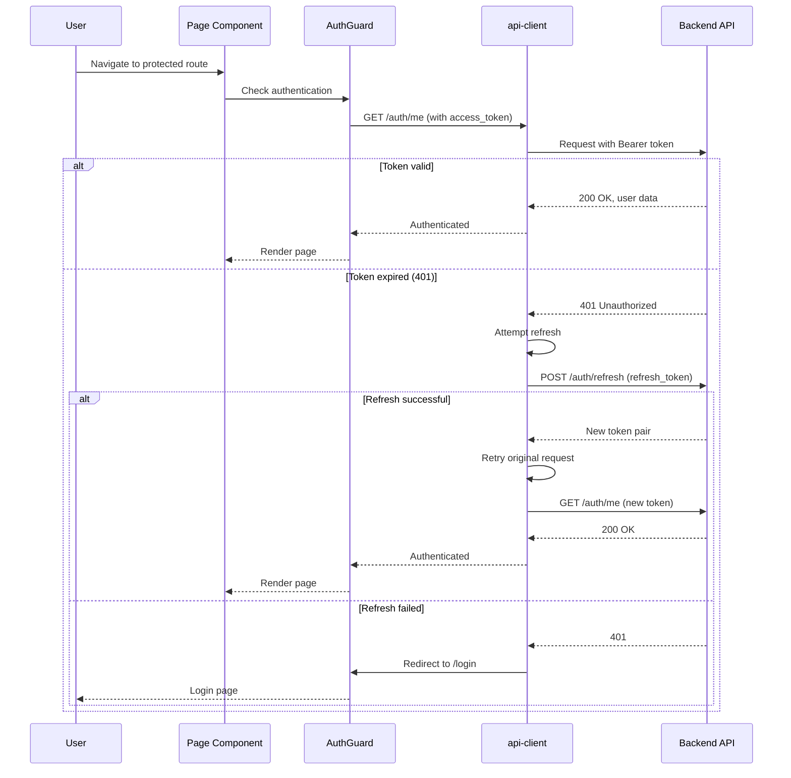
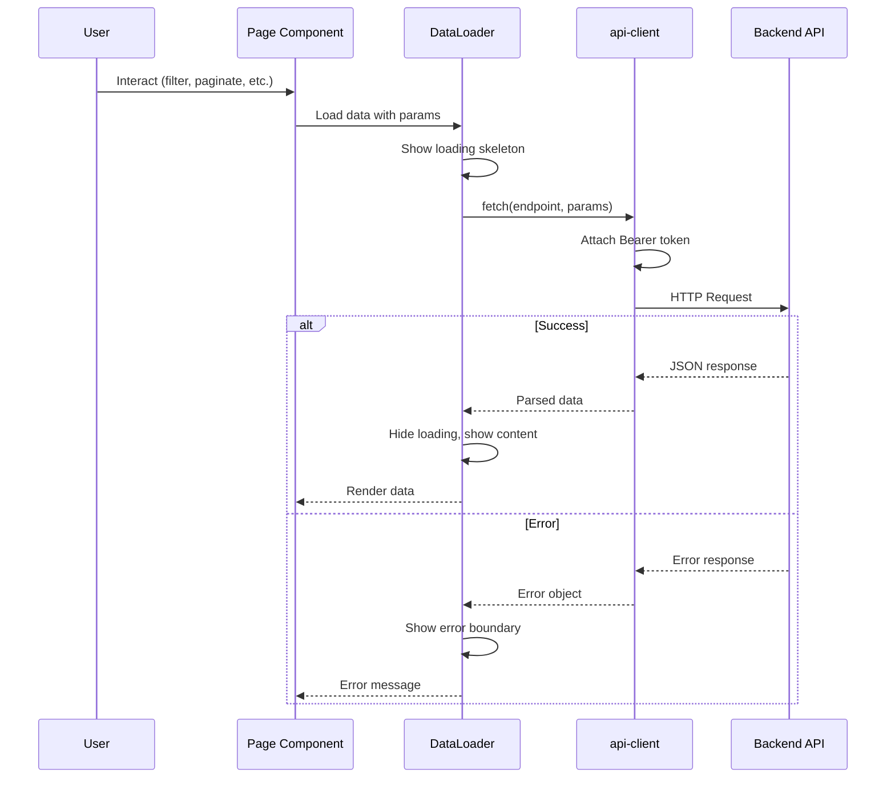

# Sprint 3 - Next.js Frontend & End-to-End Integration

## Goal
Build the full Next.js 15 frontend with TypeScript and Tailwind CSS, covering all backend API surfaces. Establish frontend testing patterns, Docker integration, and CI checks.

## Frontend Component Hierarchy

```mermaid
graph TD
    subgraph Layout
        Root[RootLayout]
        AL[AuthLayout<br/>(login, register)]
        DL[DashboardLayout<br/>Sidebar + Header]
        AG[AuthGuard]
    end

    subgraph Pages ["Pages (14 routes)"]
        Login[Login]
        Register[Register]
        DB[Dashboard]
        ACC[Accounts]
        TX[Transactions]
        BUD[Budgets]
        PORT[Portfolio]
        PCB[Category Breakdown]
        IVE[Income vs Expenses]
        MT[Monthly Trends]
        NW[Net Worth]
        CON[Connect]
        CI[Connect/Institutions]
        PROF[Profile]
    end

    subgraph UI ["UI Primitives (10)"]
        Button
        Input
        Card
        Table
        Badge
        Modal
        Spinner
        Select
        Pagination
        Toast
    end

    subgraph Charts ["Recharts Wrappers"]
        BarChart
        PieChart
        LineChart
    end

    subgraph Lib ["Library Layer"]
        AC[api-client.ts]
        AUTH[auth-context.tsx]
        TYPES[types.ts]
    end

    AL --> AG
    DL --> AG
    AG --> AC
    AC --> AUTH

    Login --> AL
    Register --> AL
    DB --> DL
    ACC --> DL
    TX --> DL
    BUD --> DL
    PORT --> DL
    PCB --> DL
    IVE --> DL
    MT --> DL
    NW --> DL
    CON --> DL
    CI --> DL
    PROF --> DL

    DB -->|uses| Card
    DB -->|uses| Table
    DB -->|uses| Spinner
    DB -->|uses| BarChart

    TX -->|uses| Table
    TX -->|uses| Input
    TX -->|uses| Select
    TX -->|uses| Button
    TX -->|uses| Modal
    TX -->|uses| Pagination

    PORT -->|uses| Table
    PORT -->|uses| PieChart
    PORT -->|uses| Card

    PCB -->|uses| PieChart
    IVE -->|uses| BarChart
    MT -->|uses| LineChart
    NW -->|uses| LineChart
```

## Auth Guard / Token Refresh Flow



## Page → API Data Flow



## Deliverables

### 1. Next.js Project Scaffolding (`frontend/`)

| Feature | Detail |
|---------|--------|
| Framework | Next.js 15 (App Router) |
| Language | TypeScript (strict mode) |
| Styling | Tailwind CSS v4 |
| Linting | ESLint with `eslint-config-next` |
| Docker | Multi-stage: deps → build → standalone |
| Compose | HMR volume mounts |

**Folder structure:**
```
frontend/src/
  app/
    (auth)/               # login, register
    (dashboard)/          # authenticated layout with sidebar
      page.tsx            # dashboard home
      accounts/
      transactions/
      budgets/
      portfolio/
      reports/
      connect/
  components/
    ui/                   # Button, Input, Card, Table, Badge, Modal, Spinner, Select, Pagination, Toast
    layout/               # Sidebar, Header, AuthGuard
    charts/               # Recharts wrappers
  lib/
    api-client.ts         # fetch wrapper with auth interceptor
    auth-context.tsx      # AuthProvider + useAuth hook
    types.ts              # TypeScript types matching all backend schemas
  hooks/
```

### 2. API Client & Auth Layer (`frontend/src/lib/`)

| Module | Description |
|--------|-------------|
| `api-client.ts` | Fetch wrapper with base URL, auto Bearer header, 401 interceptor (refresh → retry → redirect) |
| `auth-context.tsx` | AuthProvider with login/register/logout/refresh, tokens in memory + localStorage, session validation on mount |
| `AuthGuard` | Component that redirects to `/login` if unauthenticated |

### 3. Shared UI Primitives (10 components)

| Component | Props | Notes |
|-----------|-------|-------|
| `Button` | `variant`, `loading`, `disabled`, `size` | Spinner on loading |
| `Input` | `label`, `error`, `type` | Validation error display |
| `Card` | `title?`, `action?` | Content container |
| `Table` | `columns`, `data`, `onRowClick?`, `loading?` | Sortable columns |
| `Badge` | `variant` (success/warning/error/info) | Status display |
| `Modal` | `open`, `onClose`, `title` | Overlay with close |
| `Spinner` | `size` | Loading indicator |
| `Select` | `label`, `options`, `value`, `onChange`, `error` | Dropdown |
| `Pagination` | `offset`, `limit`, `total`, `onChange` | Page nav |
| `Toast` | via `useToast` hook | Notifications |

### 4. Pages (14 routes)

| Route | Auth | Key API Calls | Components Used |
|-------|------|--------------|-----------------|
| `/login` | No | `POST /auth/login` | Input, Button |
| `/register` | No | `POST /auth/register` | Input, Button |
| `/` (Dashboard) | Yes | `GET /accounts`, `GET /reports/net-worth`, `GET /reports/income-vs-expenses`, `GET /transactions?limit=5` | Card, Table, Spinner, BarChart |
| `/accounts` | Yes | `GET /accounts`, `POST /accounts/{id}/sync`, `DELETE /accounts/{id}` | Table, Button, Modal |
| `/transactions` | Yes | `GET /transactions` (filtered + paginated), `PATCH /transactions/{id}`, `POST /transactions` | Table, Input, Select, Button, Modal, Pagination |
| `/budgets` | Yes | `GET /budgets`, `POST /budgets`, `PUT /budgets/{id}`, `DELETE /budgets/{id}` | Card, Modal, Input, Button |
| `/portfolio` | Yes | `GET /portfolio/holdings`, `POST /portfolio/holdings`, `PUT/DELETE /portfolio/holdings/{id}`, `GET /portfolio/summary` | Table, Card, PieChart, Modal |
| `/reports/category-breakdown` | Yes | `GET /reports/category-breakdown` | PieChart, Select |
| `/reports/income-vs-expenses` | Yes | `GET /reports/income-vs-expenses` | BarChart, Select |
| `/reports/monthly-trends` | Yes | `GET /reports/monthly-trends` | LineChart, Select |
| `/reports/net-worth` | Yes | `GET /reports/net-worth` | LineChart, Select |
| `/connect` | Yes | `GET /connect/connections`, `DELETE /connect/connections/{id}` | Table, Button, Modal |
| `/connect/institutions` | Yes | `GET /connect/institutions`, `POST /connect/requisitions`, `GET /connect/requisitions/{id}` | Card, Button |
| `/profile` | Yes | `GET /auth/me` | Card, Input |

### 5. Key Pages Detail

| Page | Features |
|------|----------|
| **Dashboard** | Net worth card, income vs expenses bar chart (Recharts), account summary cards, recent transactions (compact table). Loading skeletons per section. Error boundaries isolate failing sections. |
| **Transactions** | Filterable table (date range, account, category, status, search text). Pagination via offset/limit. Row click opens detail modal with category override. "Add Manual" button opens create modal. |
| **Budgets** | Card grid with progress bars (color shift at 80%/100%). CRUD via modals. Computed `spent`, `remaining`, `progress_pct` from backend. |
| **Portfolio** | Summary card (market value, gain/loss, allocation donut chart via Recharts). Holdings table with computed market_value. Add/edit/delete via modals. |
| **Reports (4 pages)** | Each has date range/month count selector + appropriate Recharts chart (PieChart, BarChart, LineChart). Data from report endpoints. |
| **Bank Connect** | Institution grid with logos. Requisition flow: select institution → redirect to Nordigen → poll status → accounts created. Connections list with disconnect. |

### 6. Testing Strategy

**Unit (Vitest + React Testing Library) — 40 tests (all passing):**

| Component | Tests | Coverage |
|-----------|-------|----------|
| Button | 6 | Variants, loading, disabled, click |
| Input | 4 | Label, error, onChange, ref |
| Badge | 2 | Children, variant styles |
| Modal | 5 | Open/close, escape key, close button, title |
| Table | 5 | Headers, rows, empty state, row click, loading |
| Pagination | 6 | Hidden on 1 page, page info, prev/next, disabled states |
| Card | 3 | Children, title, action |
| Spinner | 2 | Render, size classes |
| Select | 5 | Label, options, placeholder, onChange, error |
| Toast | 2 | Message display, throws outside provider |

**E2E (Playwright) — 15 tests:**
| Category | Count | Description |
|----------|-------|-------------|
| Auth | 6 | Landing page, login form, register form, invalid login, navigation between auth pages |
| Navigation | 7 | Redirect to login for all protected routes |
| Dashboard | 2 | Landing page content |

**CI Integration (`.github/workflows/ci.yml`):**
| Job | Command | Description |
|-----|---------|-------------|
| `frontend-lint` | `npm run lint` | ESLint with `eslint-config-next` |
| `frontend-test` | `npm test` | Vitest unit tests (parallel, no DB needed) |
| `frontend-build` | `npm run build` | Type-check + production build (depends on lint + test) |

### 7. Key Decisions

| Decision | Choice | Rationale |
|----------|--------|-----------|
| State management | React Context + `useEffect` | Sufficient scope |
| HTTP client | Native `fetch` wrapper | Zero dependencies |
| Date handling | `date-fns` | Lightweight, tree-shakeable |
| Charts | Recharts | Per SRS, React-native |
| Testing | Vitest + RTL + Playwright | Fast, modern, Next.js compatible |
| Auth storage | `localStorage` + memory | Simple for MVP |
| Data fetching pattern | `DataLoader` component | Loading/empty/error/success in one place |

### 8. Implementation Order

```mermaid
flowchart LR
    S1[1. Scaffold Next.js + Docker]
    S2[2. TypeScript types]
    S3[3. api-client + auth]
    S4[4. Layout + AuthGuard]
    S5[5. UI primitives]
    S6[6. Auth pages]
    S7[7. Dashboard]
    S8[8. Accounts]
    S9[9. Transactions]
    S10[10. Budgets]
    S11[11. Portfolio]
    S12[12. Reports]
    S13[13. Connect]
    S14[14. Profile]
    S15[15. Tests]
    S16[16. CI]
    S17[17. E2E verify]

    S1 --> S2 --> S3 --> S4 --> S5
    S5 --> S6 --> S7 --> S8
    S8 --> S9 --> S10 --> S11
    S11 --> S12 --> S13 --> S14
    S14 --> S15 --> S16 --> S17
```



### 9. Test Summary

| Category | Count | Status |
|----------|-------|--------|
| Component unit tests | 40 | ✅ All passing |
| E2E tests | 15 | ✅ Configured (requires running backend) |
| CI jobs | 3 (lint + test + build) | ✅ Added to `.github/workflows/ci.yml` |
| **Total** | **55** | ✅ |

### 10. Sprint 3 Completion Checklist

- [x] Scaffold Next.js 16 + TypeScript + Tailwind v4 + App Router
- [x] Folder structure (14 route groups, 3 component dirs, lib, hooks)
- [x] Multi-stage Dockerfile + `next.config.ts` standalone output + `docker-compose.yml`
- [x] TypeScript types (all enums + 30+ interfaces matching backend schemas)
- [x] `api-client.ts` (fetch wrapper with 401 auto-refresh)
- [x] `auth-context.tsx` (AuthProvider, useAuth, login/register/logout)
- [x] `AuthGuard` + responsive layout (Sidebar + Header, mobile overlay)
- [x] 10 shared UI primitives (Button, Input, Card, Table, Badge, Modal, Spinner, Select, Pagination, Toast)
- [x] 15 pages (Login, Register, Dashboard, Accounts, Transactions, Budgets, Portfolio, Profile, 4 Reports, Connect, Institutions)
- [x] Recharts charts (BarChart, PieChart, LineChart)
- [x] Vitest + React Testing Library (40 unit tests, all passing)
- [x] Playwright (15 E2E tests configured)
- [x] CI jobs for frontend (lint + test + build)
- [x] Build verified: 15 routes, 0 TypeScript errors 


